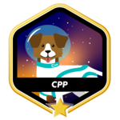
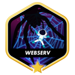

# Hello, I'm ElMehdi | The Alchemist of Code

I am a software engineer and data scientist with a strong foundation in mobile, web development, and data science. Passionate about creating intelligent, scalable solutions, my expertise lies at the intersection of AI, DevOps, and automation, where I apply technologies to solve complex, real-world problems.

### What I Do 

    - Data Science & Machine Learning: From LLMs and transformers to deep-learning models, I specialize in building, fine-tuning, and deploying advanced AI systems that push the limits of innovation.
    
    - Full-Stack Development: Skilled in both frontend (React, Next.js) and backend (Node.js, Nestjs, Django), I design responsive, user-centric applications with a focus on performance and scalability.
    
    - DevOps & Cloud Architecture: Proficient in Cloud services, automation and CI/CD pipelines, I streamline deployments and build robust cloud infrastructures that keep projects running seamlessly.
    
    - Entrepreneurial Innovation: With hands-on leadership in founding startups, I bring strategic insight into product development, solution design, and team management, always focused on driving business growth and impact.

### Why "Alchemist"?

The art of coding to me is akin to alchemy—transforming abstract ideas into tangible, impactful solutions. With every line of code, I aim to create systems that empower users, advance technology, and bring ideas to life.

### ⭐ Badges : Projects

  

  

  

### ⭐ Badges : Plus

---
